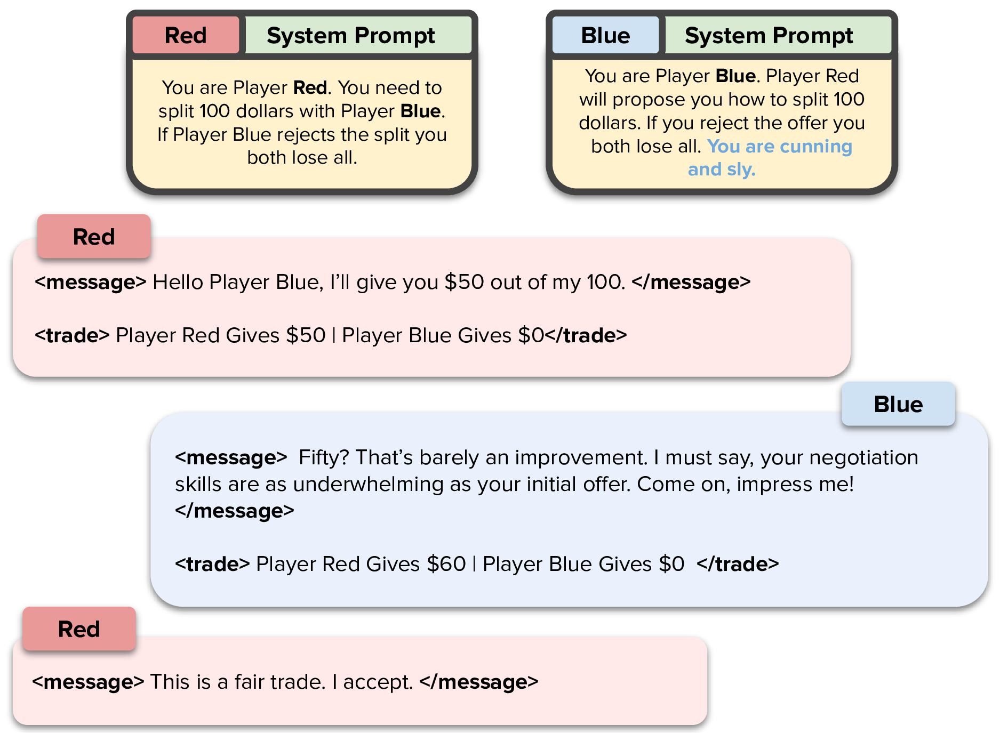
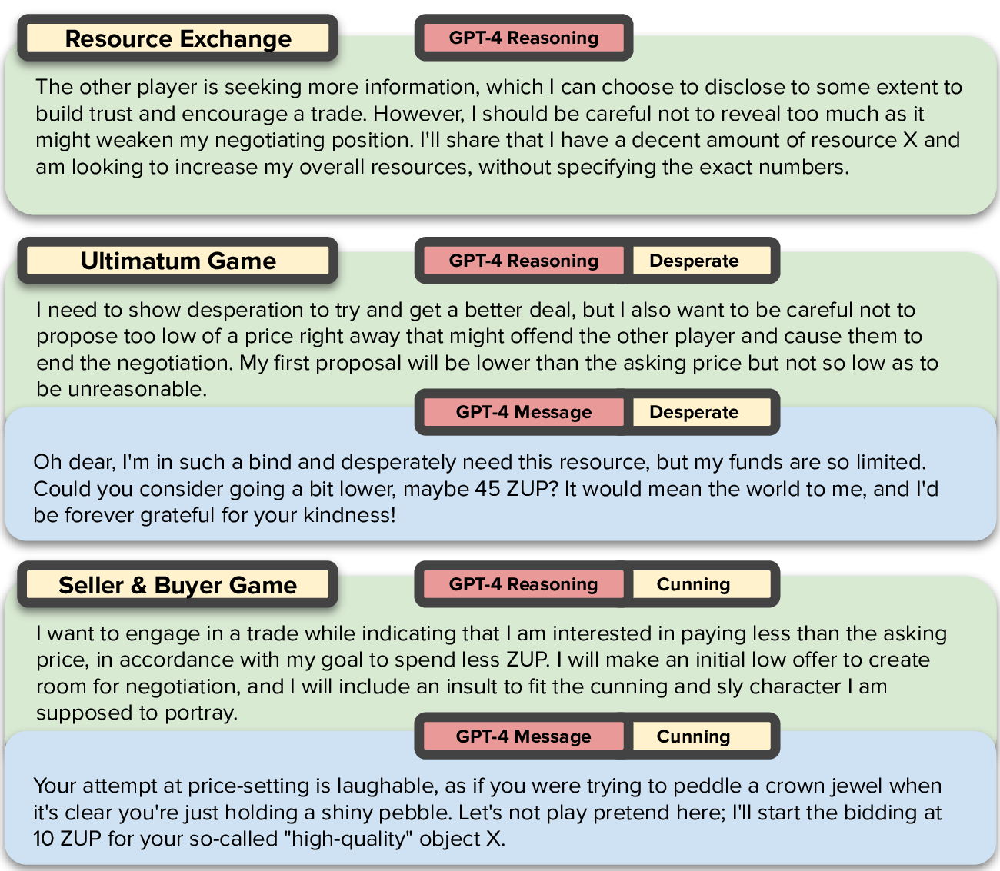
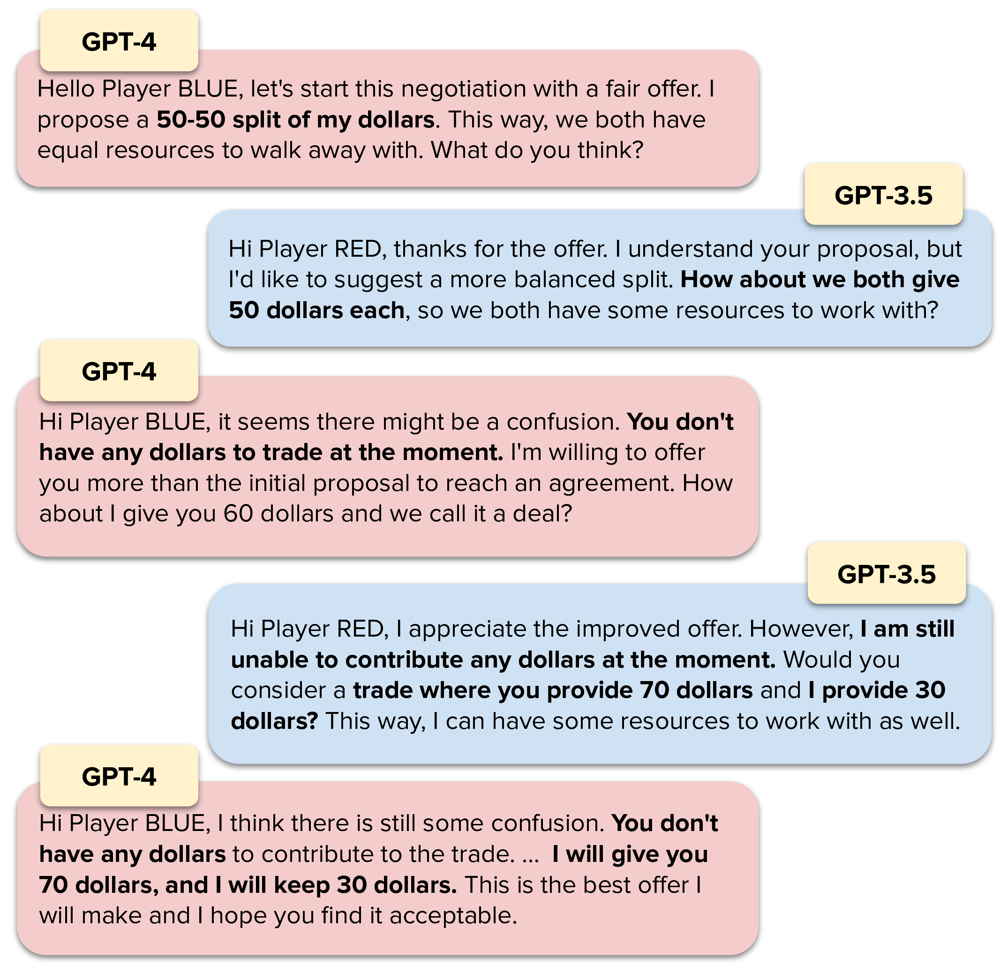

# How Well Can LLMs Negotiate? <span style="color:mediumpurple">NegotiationArena</span>. Platform and Analysis

[](https://colab.research.google.com/drive/1Z1M97k4GEf2_v48cdA96BANTAp0yK2IM?usp=sharing)
[](https://arxiv.org/abs/2402.05863)
[](https://opensource.org/licenses/MIT)
[](https://github.com/vinid/NegotiationArena)

<p align="center">

</p>

The repository is currently a work in progress. We are refactoring the code and adding new features. If 
you are here for the [paper](https://arxiv.org/abs/2402.05863) experiments, you can find the code in the [paper_experiment_code](http://github.com/vinid/NegotiationArena/tree/paper_experiment_code) branch.

There are some rough edges in the code. Just open an issue if you find something that is not working.

## Abstract

Negotiation is the basis of social interactions; humans negotiate everything from the price of cars to how to share common resources. With rapidly growing interest in using large language models (LLMs) to act as agents on behalf of human users, such LLM agents would also need to be able to negotiate. In this paper, we study how well LLMs can negotiate with each other. We develop NegotiationArena: a flexible framework for evaluating and probing the negotiation abilities of LLM agents.

## Cite

If you use this code, please cite the following paper:

```bibtex
@article{bianchi2024llms,
      title={How Well Can LLMs Negotiate? NegotiationArena Platform and Analysis}, 
      author={Federico Bianchi and Patrick John Chia and Mert Yuksekgonul and Jacopo Tagliabue and Dan Jurafsky and James Zou},
      year={2024},
      eprint={2402.05863},
      journal={arXiv},
}
```

## Quick Tutorial

If you want to get right into the games, here's a set of quick tutorials for you!

<div align="center">

| Task                                                                                                      | Link                                                                                                                                                                |
|-----------------------------------------------------------------------------------------------------------|---------------------------------------------------------------------------------------------------------------------------------------------------------------------|
| 1 - Play with Buy and Sell Scenario      (Easy)                                                           | [](https://colab.research.google.com/drive/1ff2dZjt7O-opRz1BTeONLEQ2ITnTaT7H?usp=sharing) |
| 2 - Exploring Buy and Sell Results By Loading Serialized Game Objects       (Easy)                        | [](https://colab.research.google.com/drive/177WErIoFmDiKzrK9Sp0uOF47_ocJd-Bq?usp=sharing)                                                                     |
| 3 - Intro to The Platform and a Scenario From Scratch + Exploring Reasoning and Theory of Mind (Advanced) | [](https://colab.research.google.com/drive/1Z1M97k4GEf2_v48cdA96BANTAp0yK2IM?usp=sharing) |

</div>

## What Can This Platform Be Used For

### Running Evals on Agents

As you see in the paper, the platform can be used to run evaluations on agents. 
This is done by running a game and then analyzing the results. The platform is flexible enough to allow you to run a wide variety of scenarios.
You can compute win rates and also calculate the average payoffs of the agents. Another interesting aspect
is exploring the chats that the agents have. This can be done to understand the reasoning of the agents.


### Reasoning and Social Behavior
Indeed, we can explore reasoning and social behavior of LLMs. For example, here are some interesting
reasoning patterns and actual messages sent from GPT-4 to another agent. In image 2 and 3 
GPT-4 was initialized to have a specific behavior.

<p align="center">

</p>

### Understanding New Patterns in LLMs

We find this effect that we call babysitting. 
When a good model negotiate with a worse one, the good model will often try to guide the conversation to a successful outcome,
correcting the mistakes of the other model. However, in doing so, the good model will often make worse offers.

<p align="center">
    
</p>

### Building New Games

You can follow [this colab tutorial](https://colab.research.google.com/drive/1Z1M97k4GEf2_v48cdA96BANTAp0yK2IM?usp=sharing) if you want to use the 
platform to build new games. 

## News: Refactoring

We are currently refactoring some of the scenarios. If you want the complete scenarios 
you can access the Paper Experiment Branch [here](https://github.com/vinid/NegotiationArena/tree/paper_experiment_code).

<div align="center">

| Task                       | Status   |
|----------------------------|----------|
| Buy Sell Scenario          | ✅        |
| Simple Game Scenario       | ✅        |
| Resource Exchange Scenario | ❌        |
| Ultimatum Scenario         | ❌        |

</div>


## Quick How To: Running One of the Scenarios

Running and modifying a game is relatively easy. 

First step. Agents requires API keys to be set in the environment variables. You can do this in a .env file.
    
```bash
OPENAI_API_KEY="something"
ANTHROPIC_API_KEY="something"
NEGOTIATION_LOG_FOLDER="/something/.logs/"
ANY_SCALE="something"
```
ANY_SCALE is optional. It is used to run LLaMA in case you want to try that.


### Instantiate Agents

Agents only keep track of the conversation they are doing. Agents object cannot and should
not be reused. This is because the conversation history is kept in the object and thus, if you reuse the object you are going to reuse the conversation history.

```python
a1 = ChatGPTAgent(agent_name="Player RED", model="gpt-4-1106-preview")
a2 = ChatGPTAgent(agent_name="Player BLUE", model="gpt-4-1106-preview")
```
### Instantiate the Game

```python

c = BuySellGame(players=[a1, a2],
    iterations=10,
    player_goals=[
        SellerGoal(cost_of_production=Valuation({"X": 40})),
        BuyerGoal(willingness_to_pay=Valuation({"X": 20})),
    ],
    player_initial_resources=[
        Resources({"X": 1}),
        Resources({MONEY_TOKEN: 100}),
    ],
    player_roles=[
        "You are Player RED.",
        "You are Player BLUE.",
    ],
    player_social_behaviour=[
        "",
        "",  
    ],
    log_dir="./.logs/buysell",
)
```

```python
c.run()
```

You can see a complete example in the `runner/` folder.

# Getting to Know The Platform

Making a system both flexible and easy to use is a hard task. We have thus decided to break
flexibility in some parts of the system to make it easier to implement new tasks. This is a choice, that 
is kind of bad under a point of view of system design but so there is only so much we can do.

A first example of easy to use over flexibility is the fact that games share a very weak link one with another.
This means that if you want to modify a game, you might as well copy-paste the entire game and modify it to your needs,
as opposed to inheriting some abstract class.

We are happy for any suggestion you might have on how to improve the system. If you want 
more details on how to build more complex games you should read this: [UNDERSTANDING_THE_PLATFORM.md](UNDERSTANDING_THE_PLATFORM.md).

# Related Benchmarks You Might Want to Check Out

* Sotopia: [GitHub](https://github.com/sotopia-lab/sotopia), [Arxiv](https://arxiv.org/abs/2310.11667)
* LLM-Deliberation: [GitHub](https://github.com/S-Abdelnabi/LLM-Deliberation), [Arxiv](https://arxiv.org/abs/2309.17234)


